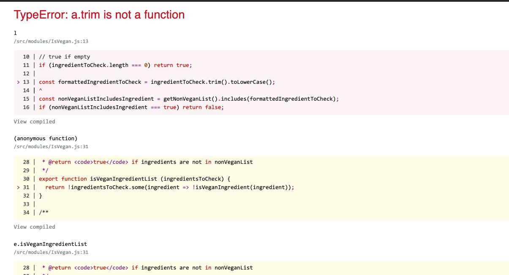

# Welcome to Taco *Tandem*onium!
Guac is *not* extra, cause it's on me 😉

I am using a ReactJS as my framework of choice with JavaScript for this application as this is, currently, at the forefront of my mind.  I am also choosing to persist the data to local storage.  For something simple like taco recipes, I think this would be pretty efficient because my assumption is that we will not be dealing with millions of records.

## Design
A freecodecademy.org course from a couple years back was my inspiration behind the design and template of the app, using create-react-app for the initial creation.

## Data
A static query for `taco` is done with an api call to originally grab taco recipes and save them in a state to be used to pass down to other component.  We also load the recipes into `localStorage`.

### Dietary Restrictions
I used an online JSON creator -- http://www.objgen.com/, except a very cool plugin for vegan I found.  
My assumptions for dietary restrictions:  
	* Dairy-free  
	* Nut-free  
    * Gluten-free   
	* Halal  
	* Vegan, Vegetarian - https://github.com/hmontazeri/is-vegan
	
```
{
  "Dairy-Free": [
    "milk",
    "sour cream",
    "soured cream",
    "butter",
    "cheese"
  ],
  "Nut-Free": [
    "peanut",
    "almond",
    "walnut",
    "pecan",
    "cashew"
  ],
  "Halal": [
    "pork"
  ],
  "Gluten-Free": [
    "flour",
    "wheat",
    "couscous"
  ]
}
```

## Components
The following are the components I choose to create.  I use the naming convention, name.type.extension.  The idea is that I would use .connect.js later on for `Redux` storing data states globally instead of using `localStorage`.
### Recipe
I used the `react-router` to properly retrieve router each recipe to its own page to based on the title. Based on the title of the another call to the api is made to grab the recipe.
### Recipes
This takes a list of recipes and displays it on the page.  Simple as that. :-)
### SearchRecipes
This is the parent component for searching. Which passes the `getRecipe` state back to the Root component to render on the page.
### DietaryRestrictions
This is where we build the identification for each recipe's dietary restrictions.  This function was written so that it could be use anywhere within the app for checking the ingredients of a recipe based on the dietary restriction.

## Further Developments & Issues
### Finish the app
I did not implement the *easy* swapping of APIs but I would have implemented a simple component and view for a user to switch between a few APIs.  The even more advanced implement would be to create a component that can interpret different API and retrieve their ingredients to find taco recipes.  You can most like do something like this with the purchase an api that would provide extra support and functionality.  


### Where I struggled
- With the dropdown filter, located in the `SearchRecipes` component, you will in the console log that I am grabbing the correct list of recipes based on the api query, but I failed to implement the proper way to render that and send it back to the Recipes Component.  I think redux may be the more efficient way to hand this and not local storage which caching and such can come into play.  

- I had some trouble using the isVegan plugin and ran out of time to implement this into the filter


- I did not use redux because I did not have the confidence to use at this time.

## Final Comments
I do plan to use this and building up where or not I join the Tandem family.  It was fun to bang my head a little to create this!
    
Thank you for considering me and putting me in fron of this challenge. 👨🏾‍💻🌮
